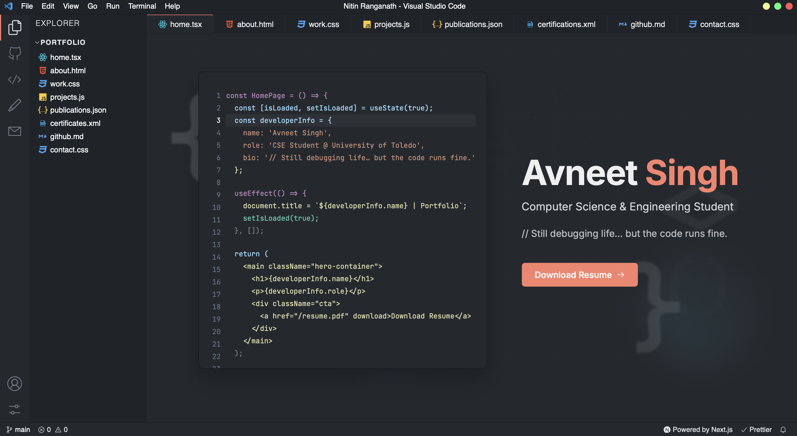

# 🌐 **Avneet Singh — Developer Portfolio**

<p align="center">
  
</p>

<p align="center">
  <b>💻 Built with Next.js · TypeScript · CSS Modules · VSCode-inspired theme</b>
</p>


## 🧭 Overview

Welcome to my **developer portfolio** — an interactive, VSCode-themed experience built with **Next.js**.  
It showcases my **projects**, **experience**, **publications**, **certifications**, and **GitHub activity**,  
designed to reflect both my personality and my craft as a developer 🚀.


## ✨ Highlights

| 🚀 Feature | 🔍 Description |
|------------|----------------|
| 🏠 **Home** | Animated VSCode-style intro with resume download |
| 💼 **Work** | Professional timeline with interactive, expandable job cards |
| 📚 **Publications** | Academic works with journal, citation, and DOI details |
| 💻 **Projects** | Showcases personal + research projects with realistic previews |
| 🧾 **Certifications** | Verified badges and credentials from Coursera and more |
| 🐙 **GitHub** | Live API integration showing repositories + contribution heatmap |


## 🧱 Tech Stack

<p align="center">
  
</p>

- ⚡ **Framework:** Next.js 14  
- 🎨 **Styling:** CSS Modules + custom VSCode-inspired variables  
- 🧩 **Language:** TypeScript  
- 🧠 **Integrations:** GitHub API, ORCID, and static JSON data  
- ☁️ **Deployment:** Vercel  


## ⚙️ Getting Started

```bash
# 1️⃣ Clone the repository
git clone https://github.com/avneetxsingh/portfolio.git

# 2️⃣ Navigate to folder
cd portfolio

# 3️⃣ Install dependencies
npm install

# 4️⃣ Run locally
npm run dev

Then open → http://localhost:3000


🌍 Environment Setup

Create a .env.local file at the project root:

NEXT_PUBLIC_GITHUB_USERNAME=avneetxsingh

(Additional API keys can be added if using ResearchGate / ORCID integrations.)


🧩 Project Structure

src/
├── components/             # Reusable UI components
│   ├── WorkCard.tsx
│   ├── PublicationsCard.tsx
│   ├── CertificationCard.tsx
│   └── RepoCard.tsx
│
├── pages/                  # Main pages
│   ├── index.tsx           # Home
│   ├── work.tsx            # Work experience
│   ├── projects.tsx        # Projects showcase
│   ├── publications.tsx    # Research publications
│   ├── certifications.tsx  # Certifications
│   └── github.tsx          # GitHub API section
│
├── styles/                 # Scoped CSS modules
│   ├── HomePage.module.css
│   ├── WorkCard.module.css
│   ├── PublicationsPage.module.css
│   ├── CertificationCard.module.css
│   └── CertificationsPage.module.css
│
└── public/
    ├── images/             # Assets (project & publication images)
    ├── logos/              # SVG/PNG logos
    └── AvneetSinghResume.pdf


🧠 Customization

✨ Area	⚙️ File / Folder
👨‍💻 Work Experience	pages/work.tsx
💻 Projects	data/projects.ts
📚 Publications	pages/publications.tsx
🧾 Certifications	pages/certifications.tsx
🏠 Home Page / Resume	pages/index.tsx
🎨 Theme Colors	globals.css or page-specific modules


🖼️ Example Sections

💼 Work Experience

<p align="center">
  
</p>


📚 Publications

<p align="center">
  
</p>


💻 Projects

<p align="center">
  
</p>


🌐 Deployment

You can deploy directly using Vercel — it’s built for Next.js apps.

npm run build
npm run start

Or connect your GitHub repository to Vercel.com.

👨‍🎓 About the Developer

Avneet Singh
🎓 MS in Computer Science — University of Toledo
💻 Passionate about AI, full-stack development, and clean architecture.
⚡ Currently exploring FastAPI, LangChain, and AI system design.

<p align="center">
  <a href="https://github.com/avneetxsingh"></a>
  <a href="https://linkedin.com/in/avneetxsingh"></a>
  <a href="mailto:avneetxsingh@gmail.com"></a>
</p>

🪪 License

This project is open-sourced under the MIT License.
Feel free to clone, modify, and use it for your own portfolio — just add attribution. ❤️

💬 Acknowledgements
	•	Next.js
	•	Vercel
	•	React Icons
	•	GitHub Calendar API

Project Template Inspiration:
https://nitinranganath.com